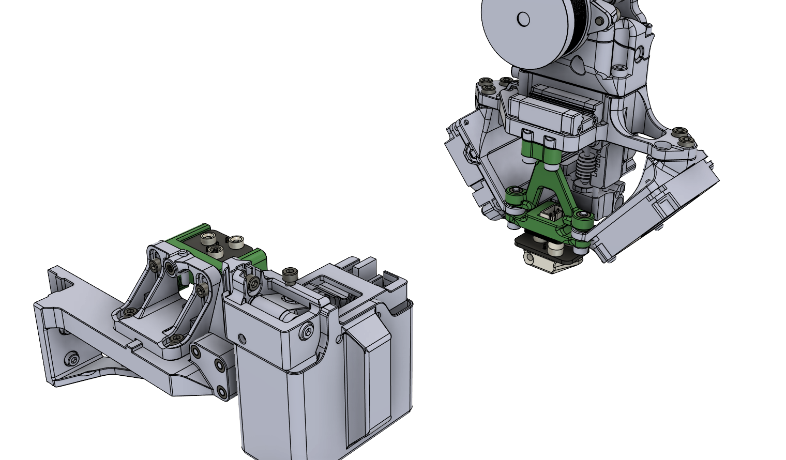
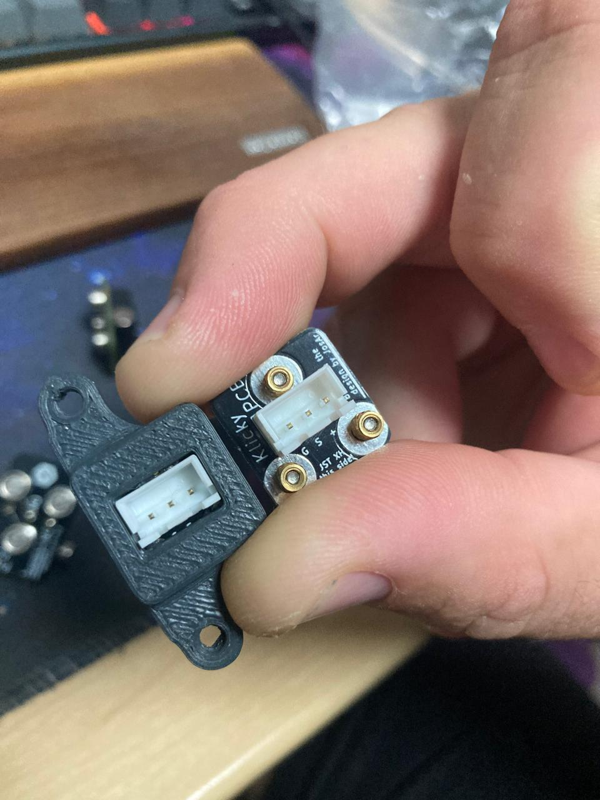
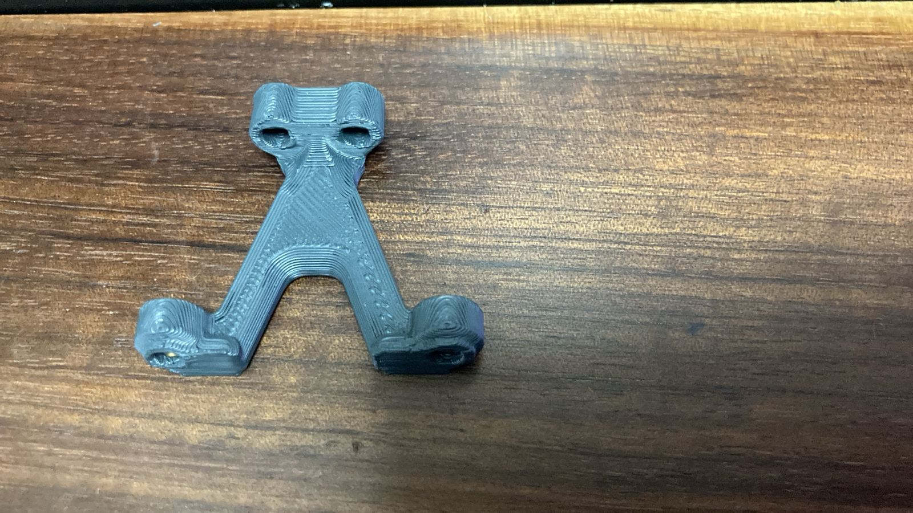
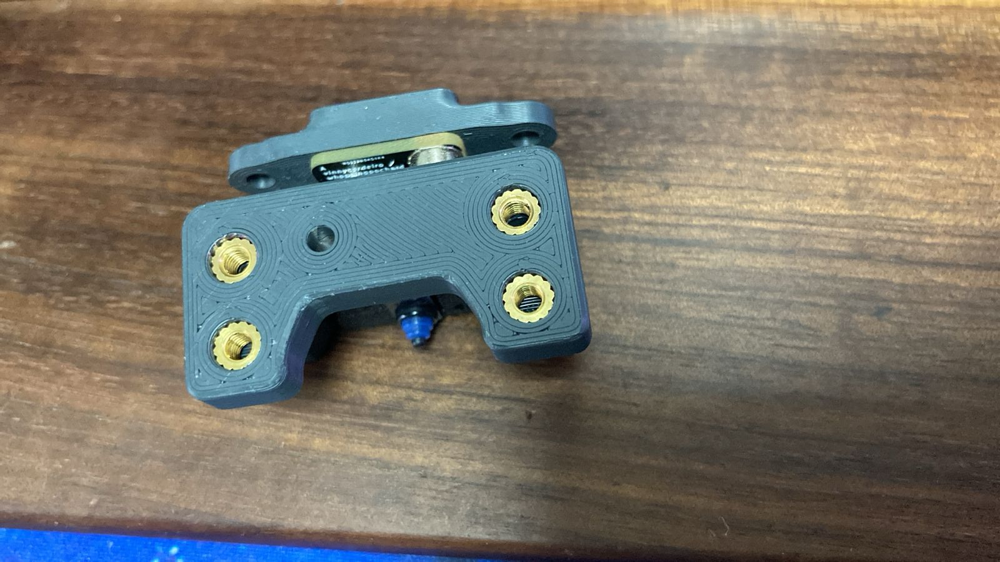
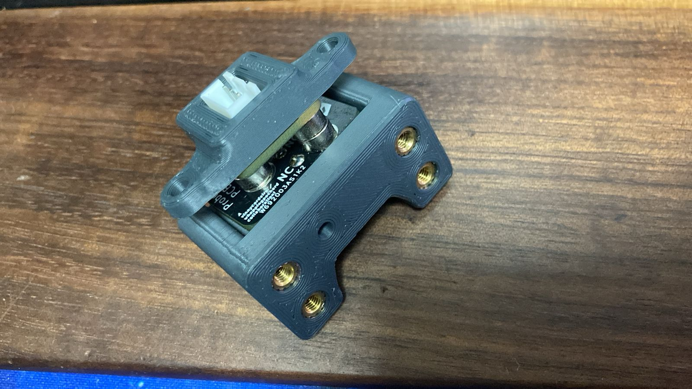
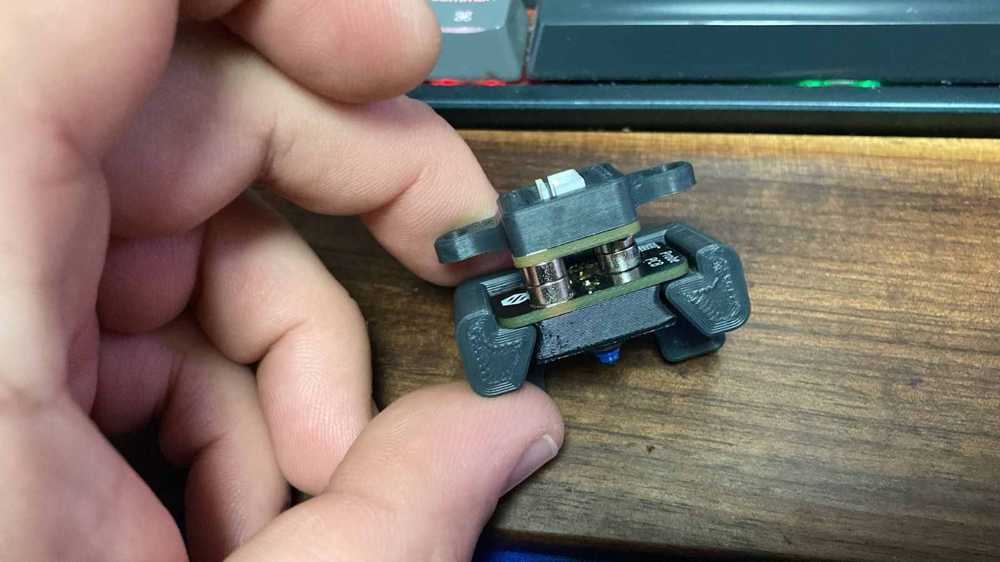

## K3 Klicky PCB 

I struggled to get hold of the magnets for the new QuickDraw, and so always ended up modifying my probe and not having the best results. The magnets would move in the plastic over time. It would catch some debris and overall got sick of inconsistent probing results.

I had Klicky PCBs laying around meant for a Voron Build, and decided to retro-fit it to my K3. I have not been running it for the longest time. But I am very happy with the initial results. It feels a lot more repeatable.



### You need
- [KlickyPCB]()
- 6 Heatset Inserts 5mm X 4mm
- 2 20mm M3 bolts for the Probe Dock top holes to ensure it's re-inforced like the original Quick Draw
- Other quick draw hardware

### Print settings
- 0.2mm layers, 50% infill, grid
- 3-4 perimeters
- ASA Plastic

### Config

I switched to using [Klicky](https://github.com/jlas1/Klicky-Probe/tree/main/Klipper_macros) some time ago for my printers. It works fairly well for the most part. 

You will need to make some config changes when using this.

**Probe offset**

The Probe offset is ~ (Adjust your Z as needed for your nozzle):

```
[probe]
pin: ~PG13 # your pin

# KlickyPCB
x_offset: -16.866
y_offset: 0

# Less is higher from the bed, more is closer to the bed 
z_offset: 12.47 # V6 style Pheatus nozzle
```

**Dock position**


My klicky variables which changed TL;DR:
```
variable_docklocation_x:      -8    # X Dock position
variable_docklocation_y:      181    # Y Dock position

# Dock move, final toolhead movement to release the probe on the dock
#it's a relative move
Variable_dockmove_x:             0
Variable_dockmove_y:             -6
Variable_dockmove_z:             0

# Attach move. final toolhead movement to attach the probe on the mount
#it's a relative move
Variable_attachmove_x:           -30
Variable_attachmove_y:           0
Variable_attachmove_z:           0
```

I find it best to pick the probe up straight on the X, but when detatching, moving Y forward with 6mm or so is all you need to break the connection. 

Full klicky config:
```
[gcode_macro _User_Variables]
variable_verbose:             True    # Enable verbose output
variable_debug:              False    # Enable Debug output
variable_travel_speed:         200    # how fast all other travel moves will be performed when running these macros
variable_move_accel:          1000    # how fast should the toolhead accelerate when moving
variable_dock_speed:            50    # how fast should the toolhead move when docking the probe for the final movement
variable_release_speed:         100    # how fast should the toolhead move to release the hold of the magnets after docking
variable_z_drop_speed:          20    # how fast the z will lower when moving to the z location to clear the probe

variable_safe_z:         	    20    # Minimum Z for attach/dock and homing functions
# if true it will move the bed away from the nozzle when Z is not homed
variable_enable_z_hop:        True    # set this to false for beds that fall significantly under gravity (almost to Z max)

variable_max_bed_y:            182    # maximum Bed size avoids doing a probe_accuracy outside the bed
variable_max_bed_x:            128    # maximum Bed size avoids doing a probe_accuracy outside the bed

# if a separate Z endstop switch is in
# use, specify the coordinates of the switch here (Voron).
# Set to 0 to have the probe move to center of bed
variable_z_endstop_x:         0
variable_z_endstop_y:         0

#Check the printer specific documentation on klipper Dock/Undock configuration, these are dummy values
#dock location
variable_docklocation_x:      -8    # X Dock position
variable_docklocation_y:      181    # Y Dock position
variable_docklocation_z:      -128    # Z dock position (-128 for a gantry/frame mount)

#The following variables are used if the dock is deployed and retracted via a servo motor
variable_enable_dock_servo:  False    # Set to true if your klicky dock is servo-controlled
variable_servo_name:        'NAME'    # The name of the dock servo defined in printer.cfg under [servo]
variable_servo_deploy:          10    # This EXAMPLE is the value used to deploy the servo fully
variable_servo_retract:         11    # This EXAMPLE is the value used to retract the servo fully (initial_angle in [servo] config)
variable_servo_delay:          250    # This is a delay to wait the servo to reach the requested position, be carefull with high values

#Dock move, final toolhead movement to release the probe on the dock
#it's a relative move
Variable_dockmove_x:             0
Variable_dockmove_y:             -6
Variable_dockmove_z:             0

#Attach move. final toolhead movement to attach the probe on the mount
#it's a relative move
Variable_attachmove_x:           -30
Variable_attachmove_y:           0
Variable_attachmove_z:           0

#Umbilical to help untangle the umbilical in difficult situations
variable_umbilical:          False    # should we untangle the umbilical
variable_umbilical_x:           0    # X umbilical position
variable_umbilical_y:           0    # Y umbilical position

# location to park the toolhead
variable_park_toolhead:       True    # Enable toolhead parking
variable_parkposition_x:       40
variable_parkposition_y:       181
variable_parkposition_z:        15

variable_version:                1    # Helps users to update the necessary variables, do not update if the variables above are not updated

#Below this remark, you normally do not need to configure
#Attach move2
Variable_attachmove2_x:          0    # intermediate toolhead movement to attach
Variable_attachmove2_y:          0    # the probe on the dock
Variable_attachmove2_z:          0    # (can be negative)

variable_home_backoff_x:        10    # how many mm to move away from the X endstop after homing X
                                      # this is useful for the voron v0 to enable the toolhead to move out of the way to allow an unstricted Y homing
variable_home_backoff_y:        10    # how many mm to move away from the Y endstop after homing Y

variable_override_homing:       'X'    # configures what axis to home first
                                      #  '' = default klicky behavior (tries to avoid the hitting the dock)
                                      # 'X' = forces X to home first
                                      # 'Y' = forces Y to home first
                                      
variable_dock_on_zhome:       False    # docks the probe on Z Homing if not necessary (avoids hitting the bed on some printers  
```

### Images





