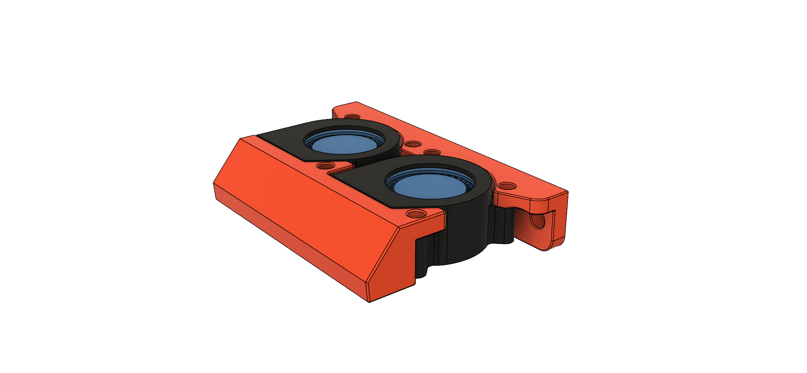
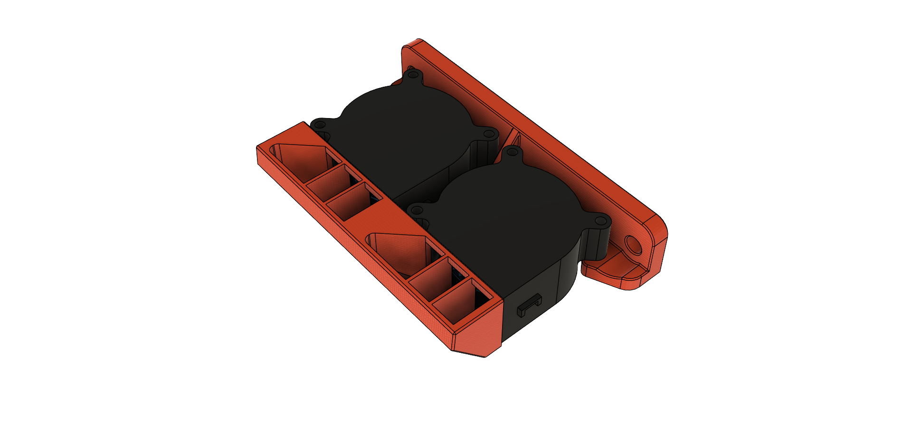
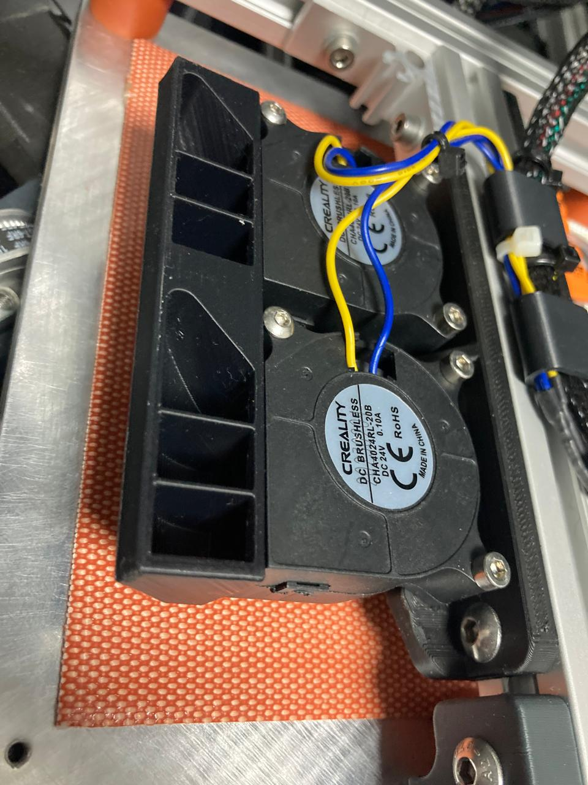
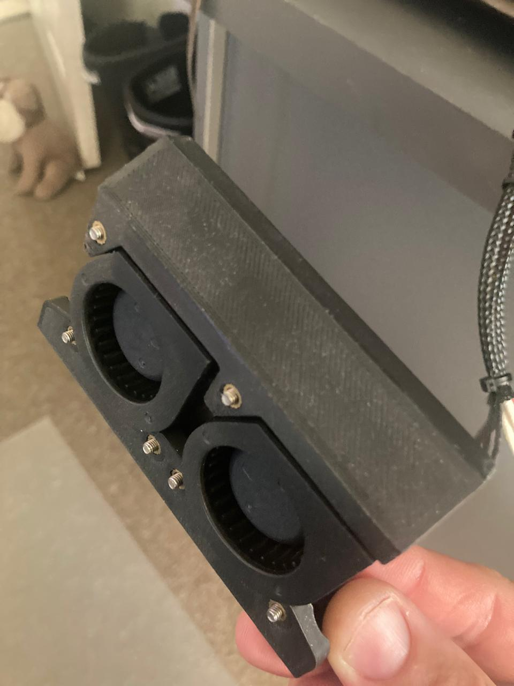
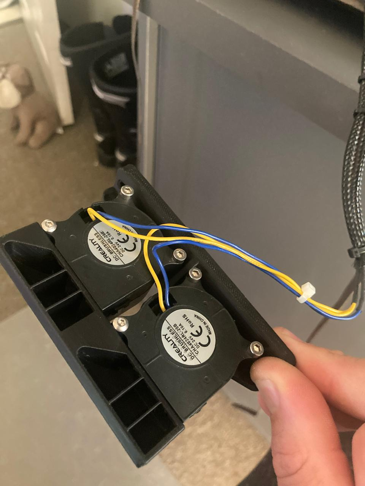

## K3 Bed Fan Mount

I designed and added these a while back to help speed up heating my chamber. It draws hot air from the bed and blows it downwards. Creating a bit of circulation in the chamber. I do feel it has made a difference, but it's hard to quantify. This is totally one worth doing if you have the stuff laying around.



### You need
- 6 Heatset inserts 5mm X 4mm
- 2 Drop in M5 nuts
- 2 8mm M5 bots
- 4 20mm M3 bolts
- 2 40x20mm blower fans like from an old Creality

### Print settings
- 0.2mm layers, 30% infill, grid
- Would suggest ASA

### Config

Using Ellis [BedFan script](https://github.com/VoronDesign/VoronUsers/blob/master/printer_mods/Ellis/Bed_Fans/Klipper_Macros/bedfans.cfg). I don't believe I changed much from the original.

Just be sure to update the pin your bedfans would use, include the config and you should be sorted.

[./Config/BedFans.cfg](./Config/BedFans.cfg)

```
# ./Config/BedFans.cfg:14
pin: PD15
```

### More images



