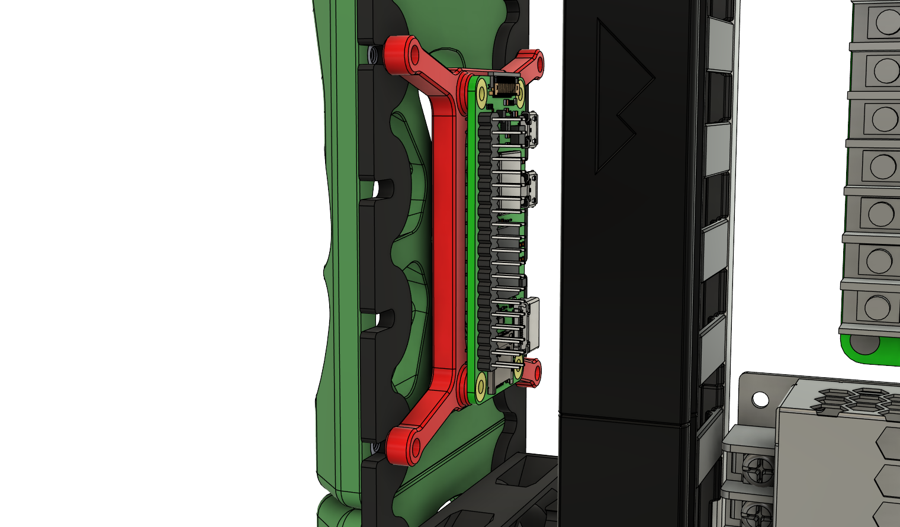
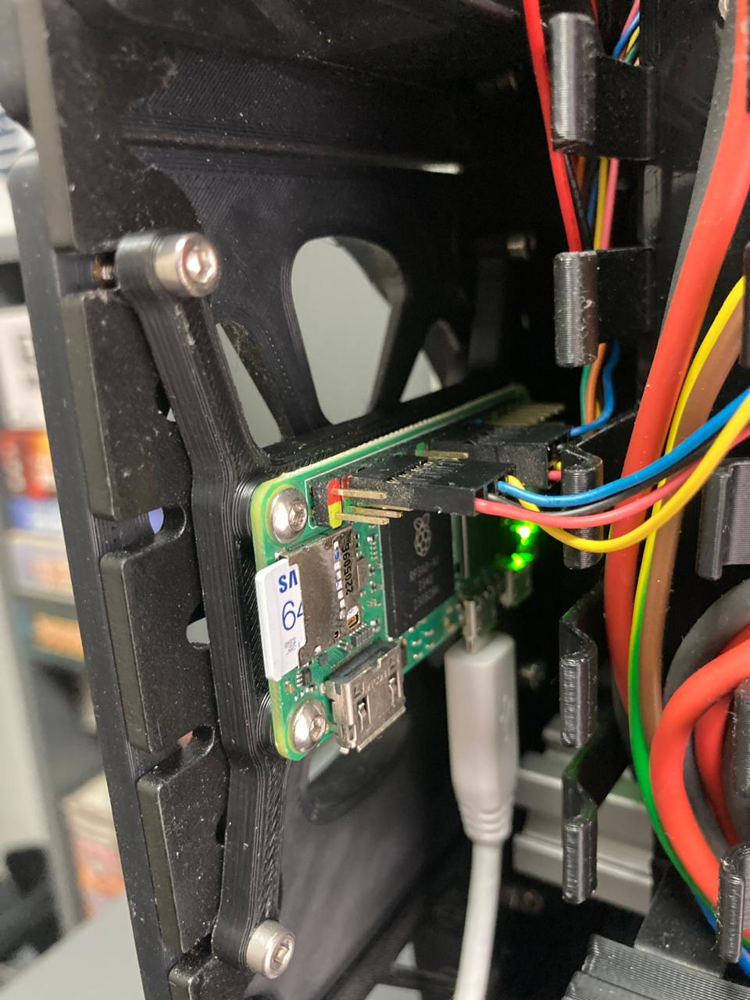
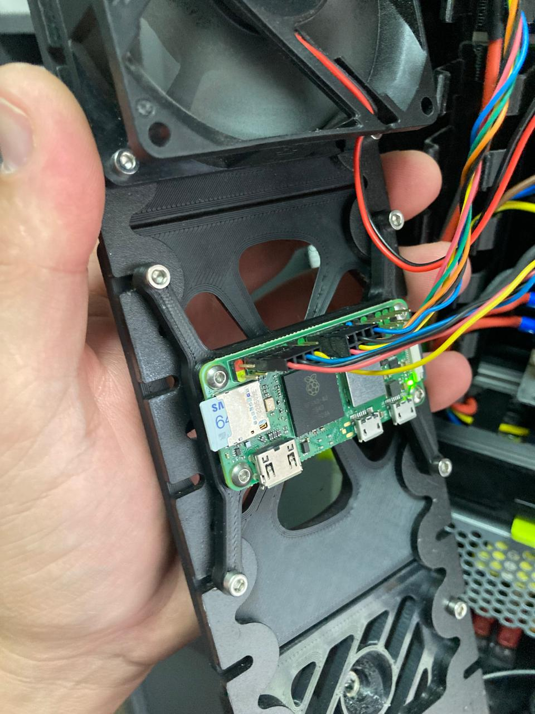

## K3 Pi Zero W2 Mount

I couldn't find a nice space to mount my MCU, so I designed a mount which uses one of the electronics Box sides. 

### You need
- 4 Heatset inserts 5mm X 4mm

### Print settings
- 0.2mm layers, 30% infill, grid
- Any plastic should do really, I used ASA

### Notes

I do use 3mm hardware because 2.5mm is a pain to find. You can drill out the PI holes to 3mm or, what I do is use a hobby knife and I rotate it around in the hole until a 3mm bolt passes through. 

# Images

